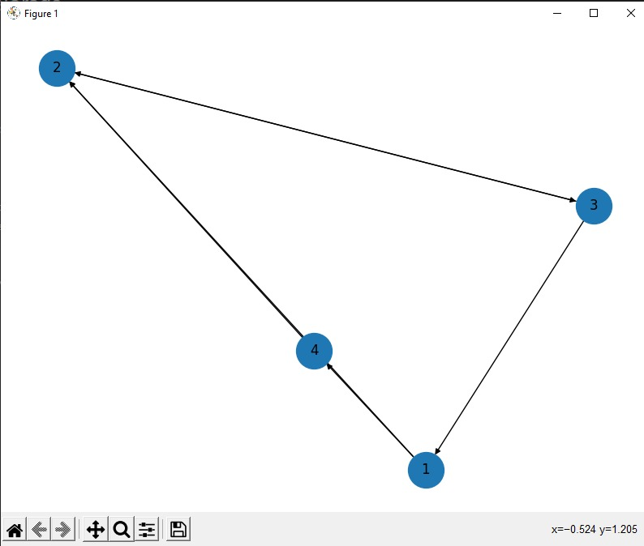

# Construccion de grafo con n nodos y m aristas

## Comenzando 🚀

_Estas instrucciones te permitirán obtener una copia del proyecto en funcionamiento en tu máquina local para propósitos de desarrollo y pruebas._


### Pre-requisitos 📋

_Instalar el programa python 3.0 en caso de no tenerlo en nuestro computador_

_Tener powershell como administrador. En caso de no tenerlo, ejecutamos como administrador y escribiremos lo siguente en la terminal de powershell: `Set-ExecutionPolicy Unrestricted`_ 


### Instalación 🔧

_Instalaremos nuestras dependencias con requirements.txt de la siguente forma:_

1. _Abrimos nuestro IDLE (como Visual Studio) o nuestra terminal_

2. _Crearemos un entorno virtual escribiendo en la terminal `python -m venv env`_

3. _Activamos el entorno virtual escribiendo en la terminal `env/scripts/activate` (windows) o `source env/bin/activate` (linux)_

4. Finalmente instalamos las dependencias en el entorno virtual escribiendo: `pip install -r requirements.txt`_

_En caso de que ciertas dependencias no se hayaninstalado, escribimos en la terminal, `pip install (nombre_de_la_libreria)`_

_De forma opcional, instalar por separado cada uno de los siguentes requeimientos:_

```python
ipython==7.30.1
matplotlib==3.5.0
networkx==2.6.3
numpy==1.21.4
pandas==1.3.4
Pillow==8.4.0
```

## Ejecutando las pruebas ⚙️

_Una vez tenga todos los pasos anteriores realizados de manera correcta, se le solicitara abrir el archivos con el IDLE de preferencia_

### Ejecucion programa 🔩

_Se le pedira ingresar una cantidad de nodos y aristas. Luego de ingresar lo pedido, se abrirá una ventana con el grafo generado, mientras que en la terminal aparecerá el calculo de la matriz resultante, La excentricidad de todos los vértices y el diámetro de la red. Al cerrar la ventana del grafo generado, de inmediato se abrira un siguente grafo, con la propuesta de estrategia fija_

### Estrategia seguida para reducir el diámetro y el costo de transporte ⌨️

_Se añadieron nuevos bordes claves entre los nodos de mayor distancia, para asi asegurar la distancia entre estos, los cuales se reducen a 1 (distancia mínima entre 2 nodos fuertemente conectados para gráfico no ponderado), por lo que el diámetro se reduce así como el total distancia (costo)._

## Ejemplos de algunos resultados

nodos: 4
aristas: 6




## Construido con 🛠️

* [Visual studio code](https://code.visualstudio.com)

## Integrantes 🖇️
_Benjamín Serra -_
_Sofía López -_
_Benjamín Zárate_


## Expresiones de Gratitud 🎁

 📢🍺☕🤓❤️😊
